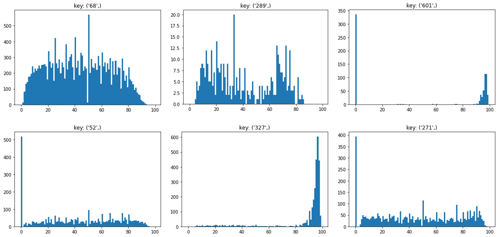

# USAGE
## Requirements
- Python >= 3.7
- pytorch >= 1.10
- transformers

## Execution commands
- training on LSTM
```
python main.py --is_train=True --is_eval=True --model_type=lstm --epoch=200 --batch_size=64 --prob=0. --num_layers=3 --save_path=/path/to/save/model
```

- evaluation on Transformers
```
python main.py --is_eval=True --model_type=transformer --num_enc_layers=2 --num_dec_layers=2 --dim_ff=512 --load_path=/path/of/loading/model
```

## Project Structure
```
|-- models/
|  |-- best_model/
|  |  |-- lstm_baseline
|  |  |-- lstm_with_label_smoothing
|  |  |-- transformer
|-- images/
|-- README.md
|-- analyze.ipynb
|-- main.py
|-- train_source.txt
|-- train_target.txt
|-- test_source.txt
|-- test_target.txt
|-- requirements.txt
```


# TASK DESCRIPTION
정수로 구성된 input sequence ("source") 를 마찬가지로 정수로 구성된 output sequence ("target") 로 mapping하는 task로, training dataset을 이용해 주어진 test dataset의 높은 generalization 성능을 달성하는 것이 목표입니다.

Dataset: [train source](train_source.txt), [train target](train_target.txt), [test source](test_source.txt), [test target](test_target.txt)
<br><br><br>

# DATA ANALYSIS
- [analyze.ipynb](analyze.ipynb) 참조
<br><br>

## Vocab Size
먼저, training dataset의 source와 target을 보고 각각 어떤 정수들로 sequence가 구성되어있는지 확인하였습니다. 확인 결과, source는 53개, target은 595개의 정수로 구성되어있었으며, 이는 다소 적은 종류의 token으로 이루어진 source sequence를 통해 더 다양한 종류로 이루어진 target sequence를 mapping할 수 있어야 함을 의미합니다.
```python
train_source: 53, train_target: 595
```

이후, 추가적으로 test dataset과 train dataset 역시 비교해보았습니다. Test dataset을 구성하고 있는 정수의 개수는 train dataset의 것보다 적었지만, train dataset에는 등장하지 않는 token 역시 등장하는 것이 확인 되었습니다. Model을 학습할 때에는 test dataset의 정보를 전혀 알지 못한다는 것을 전제로 하기 때문에, 이는 train dataset은 학습하지 못한 unknown token이 등장할 수 있다는 것을 암시합니다.
```python
# Unknown tokens
# {(integer sequence): 개수}
{('325',): 2, ('418',): 3, ('477',): 1, ('160',): 3, ('428',): 1, ('308',): 2, ('422',): 1, ('2',): 1, ('502',): 1, ('141',): 1, ('332',): 1, ('262',): 1}
```
<br><br>

## Measure N-Gram
Integer sequence의 n-gram을 계산하여 혹 여러 번 반복되는 token sequence의 패턴이 있는지 확인하였습니다. 등장 횟수 기준을 100번으로 하였을 때 총 길이가 source에서는 12개, target에서는 8개가 되는 sequence까지도 빈번하게 등장하는 것을 알 수 있었습니다.
```python
# train source
{('105', '453', '271', '68', '416', '105', '619', '437', '68', '140', '584', '68'): 122}
# target source
{('607', '339', '68', '550', '501', '68', '397', '68'): 117}
```
위 결과를 통해 주어진 sequence가 정수로만 이뤄져 있다고 해도 어떤 일련의 규칙, 즉 문법을 가지고 있는 것이 아닐까 하는 의심을 하게 되었습니다. 따라서 자연어의 특성을 어느 정도 가지고 있다는 가정을 내려 이후 과정에서는 integer sequence를 마치 자연어의 word token처럼 다루었습니다. 
<br><br>

## Matching Biggest N-Gram
Integer sequence를 word sequence라고 가정했을 때, 같은 sub-sequence를 가지고 있는 source sequences는 해당 구간에서 같은 의미를 내포하고 있다는 것을 뜻하기 때문에 그에 해당하는 target sequences도 유사한 word sequence가 등장할 가능성이 높다고 가설을 세울 수 있습니다. 이를 증명하기 위해 가장 긴 길이의 반복 sequence를 지니고 있는 source dataset을 모아 그 target sequence를 확인하였습니다.
```python
repeated_sequence = ('105', '453', '271', '68', '416', '105', '619', '437', '68', '140', '584', '68')
matched_targets = \
['607', '339', '68', '550', '501', '68', '397', '68', '538', '430', '68', '640', '68', '241', '68', '51', '558', '68', '523', '405', '85'],
['607', '339', '68', '550', '501', '68', '397', '68', '538', '430', '68', '640', '68', '241', '194', '68', '272', '247', '270'],
['607', '339', '68', '550', '501', '68', '397', '68', '211', '543', '68', '43', '158', '68', '252', '155', '149', '68', '97', '68', '189', '68', '70', '158', '68', '563', '189', '68', '657', '299'],
['607', '339', '68', '550', '501', '68', '397', '68', '201', '85', '152', '68', '5', '68', '397', '68', '211', '295', '334', '569', '68', '43', '158', '68', '570', '389', '158', '149'],
['607', '339', '68', '550', '501', '68', '397', '68', '538', '430', '68', '640', '68', '241', '68', '430', '299', '655', '68', '523', '405', '85']
# matched_repeated_sequence = ['607', '339', '68', '550', '501', '68', '397', '68']
```
그 결과, 위와 같이 target sequence에도 유사한 패턴이 반복됨을 확인할 수 있었습니다. 이를 통해 integer sequence는 자연어의 특성을 가지고 있을 것이라는 가설의 신빙성이 더 높아졌으며, source와 target을 이루는 정수의 종류가 다른 만큼 한 언어에서 다른 언어로 mapping 하는 translation task와 비슷한 성향을 띄고 있지 않을까 하는 생각이 들었습니다. 
<br><br>

## Token Position
자연어는 문법에 맞추어 문장을 구성하기 때문에 각 word가 주로 등장하는 위치가 있을 수 있습니다. 예를 들어, 한국어의 경우 '이다', '하다'와 같은 서술어는 문장 마지막에 등장할 가능성이 높으며, '나는', '그는'과 같은 주어는 처음에 등장할 가능성이 높습니다. 이를 확인하기 위해, 각 정수의 위치를 살펴보았습니다.

위 그래프는 train sources sequence들의 token 위치 분포를 나타냅니다. 가로축은 각 token의 문장 내 위치를 백분율로 표현한 것이며, 세로축은 그 위치에 등장하는 단어의 총 개수입니다. 그림에서 확인할 수 있듯이, token마다 등장하는 위치의 분포가 상이합니다. token '68'과 '289'의 경우 비교적 가운데에 위치해있으며, '601', '52', '327', '271'은 왼쪽 끝이나 오른쪽 끝에 위치해 있는 경우가 많았습니다. 이를 통해 sequence 상의 token의 배치에는 규칙이 있음을 증명했으며, 이는 자연어의 특성과 일치합니다.
<br><br><br>


# METHODS
앞서 기술했듯이 데이터 분석을 통해 이번 task를 NLP의 translation task와 같은 특성을 지녔다고 생각하여 접근하였습니다. 이에 가장 기본적인 Language Model (LM) approach를 통해 이번 task를 해결하고자 했습니다. 
<br><br>

## Tokenizer
우선, 기본적으로 sequence가 정수로 이루어져있기 때문에, 이를 tokenize 해주는 *CustomTokenizer*를 만들어 사용하였습니다. [CLS], [SEP] token을 만들어 각각 문장의 처음과 끝을 지정해주었으며, [UNK] token을 통해 tokenizer의 vocab에 없는 token을 처리할 수 있도록 하였고, [PAD] token으로 padding을 표현하였습니다. 또한 source의 언어와 target의 언어가 다른 translation task라 가정하였기에 각각의 sequence에 다른 tokenizer를 구축해주었습니다.
<br><br>

## biLSTM to LSTM
이후, token의 종류와 데이터셋의 개수, 그리고 이를 통해 결정되는 문제의 복잡도를 고려해 가벼운 neural network부터 시도해보기로 결정했습니다. 첫 시도로는 encoder에는 bidirectional LSTM을, decoder에는 LSTM을 사용한 Encoder-Decoder based Sequence-to-Sequence 구조를 구성하였습니다 (*CustomSeq2SeqModel*). 

위 model은 input sequence를 embedding layer에 통과시켜 input embedding을 가져온 뒤 encoder에 넣어 hidden vector를 구합니다. 이후 [CLS] 토큰의 embedding과 함께 decoder에 넣어 다음 token을 예측하고, 이를 [SEP] 토큰이 나올 때까지 반복합니다. 마지막으로 생성된 vector sequence를 linear layer로 구성된 head에 각각 통과시켜 token을 예측하도록 구조를 만들었습니다. 
생성된 sequence는 target sequence와 Cross Entropy로 loss를 계산합니다. 
<br><br>

## Metrics
Model의 성능을 측정하기 위해 총 3가지의 metric을 사용하였습니다. 첫번째는 **Exact Match**로, model이 예측한 prediction sequence가 정확하게 target sequence와 일치하는지 확인합니다.

두번째로는 **Similarity Score**을 사용하였습니다. exact match와 마찬가지로 각 token 별로 같은지를 비교합니다. Similarity Score의 경우 **Similarity Precision**과 **Similarity Recall**로 나누어 측정하였는데, precision의 경우 prediction sequence 중 target과 일치하는 token의 비율로, recall의 경우 target sequence 중 prediction과 일치하는 token의 비율로 정의하고 이를 측정했습니다. 

마지막으로는 **Intersection Over Union (IOU) Score**을 측정하였습니다. target token과 prediction token의 빈도를 측정하여 교집합을 구한 후, 그 개수를 합집합 개수로 나눈 값입니다. 따라서 **Similarity Score**와 달리 위치와 관계없이 token의 등장 빈도만을 활용한 유사도를 측정합니다. 
<br><br>

## Implementation Details
biLSTM encoder와 LSTM decoder 모두 layer 개수를 3개로 했고, LSTM layer의 hidden dim과 embedding layer의 embedding dim은 256으로 주었습니다. LSTM layer 사이의 droupout은 0.1을 주었습니다. 이 외에 학습 시 사용한 hyperparameter는 다음과 같습니다. 
- lr: 1e-3
- weight decay: 1e-4
- epoch: 200
- batch size: 64
<br><br>

# RESULTS
## Results of biLSTM to LSTM

|LSTM|train set|test set|
|----|---------|--------|
|Loss|0.0105|0.0310|
|Exact Match (EM)|0.8997|0.5435|
|Similarity Precision (P)|0.9671|0.7631|
|Similarity Recall (R)|0.9651|0.7565|
|IOU|0.9658|0.8073|

<br><br>

## Result Analysis
Train dataset과 test dataset에서의 model 성능을 비교했을 때, train dataset에 비해 test dataset에서의 성능이 많이 떨어짐을 알 수 있습니다. 자세히 살펴보면, EM score로는 약 43% 정도의 큰 차이가 나는 것에 비해 다른 metric에서는 similarity score는 약 23%, IOU는 약 19% 정도로 EM score보다는 차이가 더 적은 모습을 보입니다.

한편 Precision과 Recall 보다 IOU 값이 더 높다는 것은 prediction sequence가 target sequence와 token pattern은 유사하지만 일부 token의 occurence 차이가 생긴다는 것을 의미한다 볼 수 있습니다. 실제로 model의 prediction sequence를 target sequence와 비교해보면 앞서 내린 분석을 뒷받침합니다. 아래는 prediction sequence와 target sequence가 일치하지 않는 test sample들을 나열한 것인데, 현재 biLSTM to LSTM model은 비록 target sequence를 정확하게 예측하지 못하더라도 그와 유사한 sequence pattern을 출력함을 알 수 있습니다.
```python
# Results of LSTM
Predict: ['607', '479', '68', '642', '211', '68', '569', '68', '64', '550', '339', '68', '170', '108', '68', '638', '68', '70', '158', '158', '149']
Target : ['607', '479', '68', '642', '211', '68', '569', '68', '64', '550', '339', '68', '158', '108', '68', '235', '68', '119', '389', '158', '149']

Predict: ['607', '479', '68', '559', '435', '149', '68', '397', '68', '153', '189', '68', '354']
Target : ['607', '479', '68', '559', '310', '68', '397', '68', '153', '189', '68', '354']

Predict: ['339', '68', '170', '108', '68', '19', '85', '36', '211', '108']
Target : ['339', '68', '170', '108', '68', '119', '211', '282', '85']

Predict: ['550', '550', '74', '68', '523', '405', '85']
Target : ['51', '558', '68', '523', '405', '85']

Predict: ['550', '158', '543', '68', '531', '85', '359']
Target : ['550', '158', '240', '68', '531', '85', '359']

Predict: ['339', '551', '68', '354']
Target : ['339', '551', '68', '11']
```
<br><br>

# MODEL GENERALIZATION
## Generalization Methods
Train dataset에 비해 test dataset에서 성능이 저조한 문제를 해결하기 위해 다양한 방법을 시도하였습니다. 첫째로, encoder와 decoder layer에 더 강한 dropout을 적용시켰습니다. Dropout의 값은 기본값인 0.1에서 0.3으로 설정하였습니다. 더 강한 Dropout을 적용함으로써 train dataset을 외우는 것을 방지하고자 하였습니다.

두번째로는, train source dataset을 조정해보았습니다. 일정 확률로 sequence 내 token이 [UNK]으로 치환되게 해 마치 masking과 같은 효과를 나타내도록 하였습니다. 각 sequence당 최대 치환 개수는 3개로 한정하였으며, 치환이 일어날 확률은 0.3으로 설정하였습니다. 또한, sequence의 길이가 3 이상인 경우에만 적용하였습니다. 이를 통해 model이 미처 학습하지 못한 token의 입력을 받더라도 보다 강건하게 대처하고자 하였습니다.

세번째로는, loss function인 cross entropy에 label smoothing을 적용시켜 보았습니다. 이를 통해 model의 over confidence를 막아 특정 단어 sequence 패턴에 강하게 확신하지 않도록 하여 generalization 성능을 높이고자 하였습니다.

마지막으로, optimizer을 AdamW가 아닌 SGD를 사용해보았습니다. Adam과 비교하였을 때, SGD는 stochastic한 성향을 지녀 좀 더 locally unstable합니다. 이에 local minima에 빠지더라도 SGD는 Adam에 비해 더 빠져나올 가능성이 크며, 이는 곧 generalization 능력이 더 높을 수 있음을 의미합니다. 다만, SGD의 경우 Adam에 비해 수렴이 느리다는 단점이 있습니다.
<br><br>

## Results of Generalization Methods
- Train set 결과 (best)

|Model|loss|EM|similarity precision|similarity recall|IOU|
|---|--|--|--|--|--|
|LSTM|0.0105|0.8997|0.9671|0.9651|0.9658|
|LSTM (SGD)|0.0387|0.0718|0.5137|0.4992|0.4350|
|LSTM + dropout 0.3|0.0074|0.9588|0.9939|0.9945|0.9886|
|LSTM + mask 0.3|0.0072|0.9825|0.9977|0.9978|0.9925|
|LSTM + label smooth 0.1|0.0083|0.9797|0.9975|0.9976|0.9914|
|LSTM + dropout 0.3 + mask 0.3 + label smooth 0.1|0.0084|0.9839|0.9980|0.9979|0.9929|

- Test set 결과 (best)

|Model|loss|EM|similarity precision|similarity recall|IOU|
|---|--|--|--|--|--|
|LSTM|0.0310|0.5435|0.7631|0.7565|0.8073|
|LSTM (SGD)|0.0420|0.0680|0.4903|0.4746|0.4125|
|LSTM + dropout 0.3|0.0309|0.5230|0.7572|0.7520|0.7928|
|LSTM + mask 0.3|0.0325|0.5140|0.7487|0.7390|0.7893|
|LSTM + label smooth 0.1|0.0263|0.5495|0.7733|0.7634|0.8133|
|LSTM + dropout 0.3 + mask 0.3 + label smooth 0.1|0.0269|0.5325|0.7538|0.7496|0.7983|

<br><br>

## Result Analysis
위 표의 각 row는 biLSTM to LSTM model에 각각 SGD optimizer를 적용한 model, dropout을 0.3으로 증가시킨 model, masking probability를 적용시켜 data를 조정하여 학습한 model, label smoothing을 0.1로 적용시킨 model, 그리고 마지막 3개의 generalization methods를 전부 적용시킨 model의 결과를 보여줍니다. 

우선 SGD optimizer를 적용시킨 model의 경우 AdamW에 비해 그 수렴 속도가 너무 느린 탓인지 train dataset에서도 underfit 되는 모습을 보입니다.

한편 dropout과 masking probability를 적용시킨 model의 경우 generalization에 큰 효과를 보이지 않는 듯한 모습을 보입니다. 다만, 여러 hyperparameter에 대해 학습하지는 못했기에 엄밀한 검증을 위해서는 추가적인 실험이 필요할 것입니다.

마지막으로 label smoothing을 적용시킨 model의 경우 baseline model에 비해 더 높은 성능을 보였습니다. 이는 over-confidence를 막아주는 것이 generalization을 향상시키는데 어느 정도 효과가 있음을 증명합니다.
<br><br><br>

# CASE STUDY
## Transformer Model
BiLSTM to LSTM model 외에도 transformer model 구조를 사용하여 실험하고자 했습니다 (*CustomTransformerModel*). 일반적인 transformer model encoder와 decoder를 사용하였으며, 생성할 때 뒤의 token을 보지 못하도록 attention mask를 구성하여 decoder에 넣어주었습니다.

Transformer model은 encoder와 decoder의 layer 수를 각각 2로 설정해 주었고 transformer 내부의 hidden dim은 256으로, feed-forward layer의 hidden dim은 1024로 주었습니다. 
그 외의 hyperparameter는 LSTM을 학습할 때와 같지만 batch size만 8로 다르게 주었습니다. 
<br><br>

## Results of Transformer Model
- Train set 결과 (best)

|Model|loss|EM|similarity precision|similarity recall|IOU|
|---|--|--|--|--|--|
|LSTM|0.0105|0.8997|0.9671|0.9651|0.9658|
|Transformers|0.0143|0.0387|0.3411|0.7100|0.3734|

- Test set 결과 (best)

|Model|loss|EM|similarity precision|similarity recall|IOU|
|---|--|--|--|--|--|
|LSTM|0.0310|0.5435|0.7631|0.7565|0.8073|
|Transformers|0.0369|0.0280|0.2628|0.5343|0.2941|

## Result Analysis
Transformer model을 학습해 본 결과, biLSTM to LSTM model보다 더 저조한 성능을 보였습니다. 그러나 위의 similarity recall 성적을 보면 다른 metric에 비해 훨씬 더 좋은 성능을 보이는데, 그와 반대로 precision 성적은 더 낮은 것으로 보아 target token distribution에 dominant한 token으로 편향되어 예측한 결과라고 생각할 수 있습니다. 실제 transformer model의 prediction sequence를 출력하였을 때, target sequence에 비교적 빈번하게 등장하는 '68'과 같은 tokens를 많이 출력하는 모습을 보입니다. 이를 통해 이번 task에서 transformer model을 학습하기에는 model 구조가 복잡해 수렴하는데 시간이 오래걸리며, 또한 이 model보다 단순한 biLSTM to LSTM model 만으로도 충분히 task를 해결할 수 있음을 알 수 있습니다.

```python
# Results of Transformer
Predict: ['607', '479', '68', '45', '67', '68', '189', '68', '136', '550', '339', '136', '479', '235', '543', '144', '189', '68', '543', '68', '543']
Target : ['607', '158', '68', '45', '149', '68', '189', '68', '570', '389', '339', '68', '136', '479']

Predict: ['607', '158', '68', '559', '435', '68', '240', '68', '611', '189', '68', '354', '594', '594', '594', '594', '594', '136', '594']
Target : ['607', '479', '68', '559', '310', '68', '397', '68', '153', '189', '68', '354']

Predict: ['430', '635', '189', '643', '85', '68', '431', '290', '258', '406', '405', '405', '85', '85', '85', '85', '68', '405', '334', '643', '643', '85', '643', '85', '643', '643', '471', '68', '68', '85', '405', '85', '85', '85', '85']
Target : ['430', '635', '189', '643', '85', '68', '431', '290', '258']

Predict: ['370', '68', '5', '68', '253', '621', '607', '68', '68', '222', '68', '85', '252', '189', '68', '359', '359', '85', '196', '212', '85', '359', '222', '85', '85', '85', '85', '607', '85', '118', '85', '85', '85', '359', '85', '359', '85', '85', '222', '85', '85', '85', '85', '85', '222', '85', '85', '85', '85', '85', '85', '85', '85']
Target : ['370', '68', '5', '68', '330', '68', '5', '189', '68', '430', '51', '108', '68', '321', '27']

Predict: ['339', '68', '170', '108', '68', '426', '211', '596', '85', '211', '450', '149', '149', '34', '158', '149', '450', '211', '450']
Target : ['339', '68', '170', '108', '68', '119', '211', '282', '85']

Predict: ['607', '85', '68', '85', '68', '85', '68', '68', '68', '85', '68', '85', '68', '189', '85', '204', '68', '654', '68', '85', '406', '68', '85', '68', '68', '204', '68', '204', '85', '406', '85']
Target : ['51', '558', '68', '523', '405', '85']
```
<br><br><br>